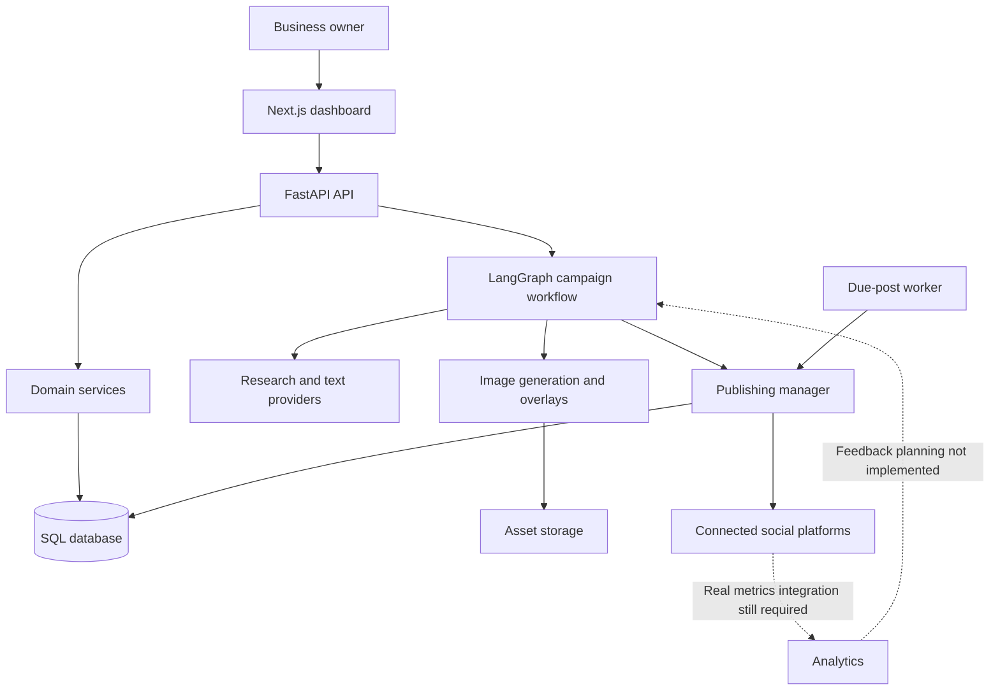

# Developer Technical Handoff Report

**Project:** Autonomous Marketing System / maeaco  
**Review date:** 7 October 2026 (Asia/Calcutta)  
**Audience:** Backend, frontend, AI workflow, infrastructure and QA developers  
**Workspace:** `D:\Autonomous-marketing-System-main`

**Document type:** Source-based technical handoff and implementation backlog; not a deployment certification.  
**Language:** Hindi owner summary, English technical sections for implementation.  
**Baseline:** Current working tree, including existing uncommitted changes. Findings must be reproduced against the actual deployment revision before rollout.

## Owner summary — मुझे प्रोजेक्ट से क्या समझ आया

यह local businesses के लिए **AI Marketing Agency in a Box** बनाने का प्रोजेक्ट है। मालिक अपनी business details, products, catalogue, brand और audience एक बार देगा। उसके बाद सिस्टम रोज़ content बनाने, उसे publish करने, Google Business संभालने और results देखकर अगली marketing योजना सुधारने का काम करेगा। मालिक को हर दिन prompt, design या posting manually नहीं करनी पड़ेगी।

अभी कोड में सबसे मजबूत आधार है: **onboarding → campaign research/planning → captions/images → review और campaign management**। Social publishing और Google Business के वास्तविक API implementations मौजूद हैं, लेकिन reliable daily operation में defects हैं। वास्तविक analytics और results से अगली strategy बदलने का पूरा loop अभी नहीं है।

मालिक के अनुसार platform deploy हुआ है, लेकिन real API keys अभी नहीं लगी हैं। इसे expected setup stage माना गया है। इस रिपोर्ट में keys न होने को bug नहीं कहा गया; ऐसे code और deployment issues बताए गए हैं जो keys लगाने के बाद भी रहेंगे।

**वर्तमान product:** AI content/campaign platform with partial publishing and local-marketing integration.  
**Intended product:** Business-aware, continuously operating marketing system with real reporting and outcome-driven planning.  
**Future extension:** Reels/video और one-click paid ads setup; business/area के हिसाब से targeting और creatives, owner-controlled budget, platform billing और approval के बाद campaign activation.

₹999 मालिक का बताया हुआ price है। Billing अवधि और limits अभी owner से तय करनी हैं। 100% autopilot, guaranteed Maps ranking, 3x leads, 10x sales, 95% savings और universal zero-distortion जैसे claims अभी verified results नहीं हैं।

### Owner-readable delivery status

| हिस्सा | वर्तमान समझ | Developer को क्या करना है |
| --- | --- | --- |
| Business और branding | Data capture और context structures हैं। | हर generation path को एक ही authorized business context देना। |
| Captions और AI images | Real generation orchestration है। | Provider errors, provenance और quality checks सही करना। |
| Catalogue posters | Upload और overlays हैं; generation selection legacy folders से भी चलता है। | Business uploads को selection pipeline से जोड़ना। |
| Daily publishing | Providers और due-post scheduler हैं। | Worker entry point, deployment और duplicate handling verify करना। |
| Google Business | Reviews/offers/description/SEO का partial code है। | Missing import, false success और account scoping ठीक करना। |
| Reports | UI मौजूद है, analytics collector mock है। | Actual platform metrics और refresh jobs बनाना। |
| लगातार autonomous marketing | पूरा loop नहीं है। | Campaign renewal, business rules और performance feedback बनाना। |
| Security/payment/support | गंभीर authorization defects हैं। | Public customer use से पहले P0 fixes पूरे करना। |

## Reading guide

- Product and architecture: sections 1–5.
- Frontend/backend contracts and defects: sections 6–8.
- Runtime configuration and delivery sequence: sections 9–11.
- Owner decisions and conclusion: sections 12–13.
- API flow map, implementation tickets and runtime validation: sections 14–18.

## 1. Executive overview

The intended product is an AI marketing service for local businesses: capture business and brand information once, generate campaigns, create branded content, publish to social channels, report real outcomes, and use those outcomes to improve subsequent campaigns. The owner should not need to design and schedule every post manually.

The repository contains a substantial implementation of onboarding, campaign generation, assets, campaign review, OAuth, publishing providers and a dashboard. It is not yet a verified, production-ready autonomous marketing service. Security weaknesses, inconsistent business context, preview defects, publishing deployment gaps, legacy catalogue selection and mock analytics prevent that conclusion.

**Owner-provided deployment context:** the platform has been deployed, but real external API keys have not yet been configured. Missing keys are an expected integration prerequisite, not an implementation defect. The findings below concern defects or missing functionality that remain after keys are supplied. The deployed server itself was not inspected.

**Commercial intent:** the owner stated a ₹999 price. Billing period and included businesses, channels, posts, images, regenerations and support allowance still need explicit definition. Do not infer unlimited usage or include advertising spend in this price without a product decision.

## 2. Review scope and confidence

This report combines source inspection of the current working tree with static verification. It is not a live integration certification.

- Inspected API registration, authentication, administrative/payment routes, campaign APIs and services, graph execution, agents, image selection, provider factories, publishing, scheduler workers, deployment files, frontend API clients and relevant pages.
- Parsed 314 Python files across `app/`, `alembic/`, `main.py` and `run_api.py`: zero syntax errors.
- Executed the installed TypeScript compiler with `--noEmit --incremental false`: passed.
- No automated Python test suite files were found in the inspected project inventory; `pytest.ini` exists. Generated images and filenames containing “test” are not automated tests.
- Did not run paid generation, publish posts, initiate payments, update Google profiles, inspect production customer data, or validate provider permissions.
- Existing local modifications were preserved. Findings apply to the reviewed working tree, not necessarily the latest Git commit or deployed version.

Status terms used here:

| Status | Meaning |
| --- | --- |
| Implemented | A substantive code path exists; live correctness is not implied. |
| Partial | Some layers exist, but important behavior or connections are missing. |
| Defective | A concrete source-level problem was identified. |
| Future | Required functionality was not found in the inspected implementation. |
| Unverified | Requires runtime, infrastructure or external-account validation. |

## 3. Architecture and repository map

| Layer | Technology / location | Responsibility |
| --- | --- | --- |
| Web application | Next.js 15, React 19, TypeScript, Tailwind 4; `autonomous-marketing-frontend-main/` | Marketing pages, login, onboarding, catalogue, campaigns, calendar, analytics, connections, support and admin UI. |
| HTTP API | FastAPI; `app/api/main.py`, `app/api/` | Request validation, routing and application-facing endpoints. |
| Domain services | `app/services/` | Business profiles, channel connections, campaign lifecycle, posts, scheduling, publications, reviews and assets. |
| Persistence | SQLAlchemy; `app/database/`, `app/repositories/`, `app/storage/` | SQL records plus compatibility paths for stored documents/files. |
| Workflow | LangGraph; `app/graph/`, `app/agents/` | Planning through publishing, with optional analytics. |
| Text providers | `app/models/providers/` | OpenAI, Hugging Face, Ollama, Gemini and Anthropic implementations. |
| Research | `app/research/`, `app/clients/` | Research collection, normalization and analysis; Tavily, Firecrawl and SEO integrations. |
| Images | `app/image/` | Source selection, provider generation, caching and brand overlays. |
| Publishing | `app/publishers/` | Platform providers, asset preparation and publication records. |
| Background work | `app/workers/` | Due-post polling, retries and Celery scaffolding. |
| Deployment | Dockerfiles, Compose, Caddy, deployment scripts, PM2 configuration | Runtime packaging and deployment routes. |

## 4. Business flow and present capability

### 4.1 Onboarding and business context

The project models users, tenants, business accounts, business profiles, brands, products, audiences and marketing preferences. Frontend onboarding clients describe brand colors, tone, logo/contact details, customer demographics, language/location and posting preferences.

The important ownership hierarchy is:

`User → active UserTenant membership → Tenant → BusinessAccount → business-specific resources and channels`

Campaign services validate tenant/business account context. However, not every API uses the same tenant resolver, and several Google/preview queries select a profile only by tenant. Every business-specific query must additionally constrain the selected business account where the resource model supports it.

### 4.2 Campaign generation

The main campaign page calls `POST /campaigns/run`. This route loads onboarding context and builds a campaign context before running the graph. Business, brand, products and audience can therefore inform generation.

`POST /campaigns/{campaign_id}/execute` is a separate existing-campaign path. It constructs a generic instruction using the campaign name but does not supply the same onboarding/campaign context. This creates inconsistent personalization and posting preference behavior.

The planner prompt defaults to a seven-day campaign and one post per day when unspecified. Longer campaigns can be requested, but 30-day output quality, latency, token limits and completeness were not tested. Do not advertise a verified 30-day generation guarantee based solely on the prompt.

Generation runs synchronously inside the campaign request path. Moving lengthy generation into a durable job with progress/status retrieval is recommended to avoid browser/proxy timeouts and repeated generation on client retry.

### 4.3 Content and creative production

- Captions, titles, hashtags, CTA and image prompts have structured schemas.
- Image strategy supports original, catalogue, AI and both source modes.
- Brand overlay code renders logo and contact details in configurable positions.
- Source-image reuse exists; universal product preservation and agency-quality output guarantees have not been demonstrated.
- Catalogue upload/list/delete exists, but campaign catalogue selection still uses legacy brand directories rather than a clearly connected tenant/business upload workflow.
- AI reels, video rendering, voiceover, music and subtitle generation were not found.

### 4.4 Review, scheduling and publication

Frontend campaign clients call backend endpoints for edit, approve, reject, schedule, start, pause, resume, complete, cancel and delete operations.

The graph registers Publisher after Scheduler, and the current publishing manager skips future-dated posts. Later, GraphRunner persists campaign and scheduled-post records. The due-post worker is intended to publish records when due. Audit this ordering carefully: due content may reach a provider before durable SQL post identities are available, so publication reconciliation and duplicate protection must be verified for that path.

The standalone scheduler implements row claiming, retry delays and recovery of stale processing records. These are useful reliability foundations. Distributed claims require PostgreSQL validation; SQLite is not a substitute for testing `FOR UPDATE SKIP LOCKED` behavior.

### 4.5 Google Business

There are code paths for review sync, AI reply generation, reply publication, promotional offers, SEO suggestions and profile-description updates. The SEO suggestions use business name, industry and city. They are not measured Google ranking results. The completeness score is produced by the model or fallback template rather than a demonstrated deterministic profile audit.

### 4.6 Analytics and autonomous improvement

The frontend requests campaign analytics and aggregates results. Backend collection currently selects a mock provider with fixed impressions, reach, likes, clicks and conversions. The graph analytics stage is disabled by default.

Real social metrics, Google Business performance interactions, refresh jobs and attribution are not implemented as a complete verified pipeline. There is no implemented closed loop that feeds actual campaign outcomes into subsequent planning.

## 5. Agent inventory

There are **12 concrete agent classes**. Nine are registered in `app/registry/agent_registry.py`; three Google Business agents are invoked separately through API/service code. Base classes and execution helpers are excluded.

| Agent | Responsibility | Notes |
| --- | --- | --- |
| PlannerAgent | Convert owner instruction into campaign objective, platforms, duration and frequency. | Model-backed. |
| BrandAssetAgent | Supply brand profile from campaign context or legacy fallback. | Mainly repository/task logic. |
| ResearchAgent | Analyze collected business, industry, audience, SEO and trend research. | Collection comes from research providers; analysis is model-backed. |
| StrategyAgent | Positioning, messaging, audience and content themes. | Model-backed. |
| ContentWriterAgent | Titles, captions, hashtags and CTA. | Model-backed. |
| ImageGeneratorAgent | Choose source/generation path and apply overlays. | Provider orchestration and image processing. |
| SchedulerAgent | Build dated publishing schedule. | Deterministic frequency/timezone logic. |
| PublisherAgent | Call the publication manager. | Provider/API task logic. |
| AnalyticsAgent | Collect campaign metrics. | Mock collector currently; default graph flag off. |
| GoogleBusinessOfferAgent | Promotional title, copy, coupon and CTA. | Separate model-backed feature. |
| ReviewResponderAgent | Reply based on rating, review and business details. | Separate service feature. |
| GoogleBusinessSeoOptimizerAgent | Description, keywords, services and checklist. | Separate feature; endpoint import defect. |

Twelve agent classes do not mean twelve independent AI models. Several share the configured provider; others are ordinary software tasks.

## 6. Frontend handoff

### Main areas

| Area | Relevant files | Review outcome |
| --- | --- | --- |
| Authentication | `lib/auth.ts`, `lib/api/auth.ts`, `components/auth/auth-guard.tsx` | Tokens/context stored in localStorage; guard checks token presence, not backend authorization. |
| Onboarding | `components/onboarding/onboarding-form.tsx`, `lib/api/onboarding.ts` | Business and brand setup implementation exists; validate each saved field reaches campaign generation. |
| Campaigns | `app/campaigns/page.tsx`, `app/campaigns/[id]/page.tsx`, `lib/api/campaigns.ts` | Real API clients for generation, lifecycle and post review. |
| Catalogue | `app/catalogue/page.tsx` | Real asset APIs; image selection integration remains a backend gap. |
| Connections | `app/connections/page.tsx`, `lib/api/connections.ts` | OAuth/channel UI; requires external permission and reconnect testing. |
| Dashboard | `components/dashboard/dashboard-page.tsx` | Incorrect publication labels and broken preview request. |
| Analytics | `app/analytics/page.tsx`, `lib/api/analytics.ts` | Requests backend data, but collector is mock; approved posts counted as published. |
| Google Business | `app/google-business/page.tsx`, `lib/api/google-business.ts` | Feature UI exists; SEO endpoint and false-success behavior need repairs. |
| Administration | `app/admin/`, `lib/api/admin.ts` | Some real API screens, some static/demo data; backend authorization must be enforced. |

`lib/api/client.ts` adds bearer authorization and parses JSON/error responses. It does not automatically add `X-Tenant-ID`; callers requiring tenant selection must supply it. Centralize authenticated business context to avoid missing headers and hardcoded IDs.

## 7. Confirmed defects and repair requirements

Priorities: **P0** blocks secure public/customer use; **P1** blocks promised core behavior; **P2** improves reliability and maintainability.

| ID | Priority | Evidence | Problem and required outcome |
| --- | --- | --- | --- |
| SEC-01 | P0 | `app/api/admin.py`: admin router, user deletion, settings endpoints | Sensitive administrative routes lack authentication/role dependencies. Require a valid server-verified admin identity on every sensitive read/write; reject anonymous and ordinary users. |
| SEC-02 | P0 | `app/api/admin.py`: `admin_login`; `app/admin/login/page.tsx`; auth guard | Default credentials are prefilled in frontend source. Login returns a random `admin_jwt_...` string without an enforced verification system. Replace with real authenticated admin sessions/claims; remove published defaults. |
| SUP-01 | P0 | `app/api/support.py`: `resolve_support_user_and_tenant`, ticket detail/message and admin endpoints | Invalid/missing authentication can fall back to a user/tenant selected from the database. Ticket details are queried by ID/number without caller ownership filtering; message lookup also lacks a tenant constraint. Replace fallback identity with verified authentication, enforce ticket ownership on every read/reply, and protect admin ticket endpoints. Do not create default users/tenants to satisfy authentication. |
| PAY-01 | P0 | `app/api/payments.py`: `verify_payment`, `create_payment_order`, webhook | Locally generated order IDs, sample checkout key and unverified payment acceptance activate subscriptions. Integrate real provider orders, signature/status checks, amount/currency matching, signed webhooks and replay-safe activation. |
| PAY-02 | P0 | `app/api/payments.py`: plan write endpoints and admin financial endpoints | Plan changes and cross-tenant financial reads lack administrative authorization. Protect and audit them. |
| DEP-01 | P0 | `.dockerignore`, `Dockerfile.backend` | `.env`, `app.db` and sensitive runtime data are not comprehensively excluded while the image copies the repository. Exclude secrets/private runtime data; inject configuration at runtime. |
| SCH-01 | P1 | `app/workers/tasks.py`, `app/workers/campaign_scheduler.py` | Task imports nonexistent `CampaignSchedulerWorker` and calls missing `run_once`. Connect the task to the actual scheduler API. Single-post task currently returns a placeholder instead of publishing. |
| SCH-02 | P1 | `docker-compose.yml`, `ecosystem.config.js` | No worker/beat or standalone scheduler service in inspected deployment configurations. Deploy one supported scheduling topology and monitor it. |
| UI-01 | P1 | `components/dashboard/dashboard-page.tsx`: around lines 694–699 | Approved or first-listed post can display “Published”. Use backend publication state and external IDs, not approval/index. |
| UI-02 | P1 | `app/analytics/page.tsx`: around line 124 | Approved posts counted as published. Count successful publication records; label unavailable metrics and surface fetch errors. |
| PRE-01 | P1 | Dashboard preview call around line 166 | Hardcoded business ID `1`, missing tenant header. Use selected authorized business context. |
| PRE-02 | P1 | `app/api/campaign_posts.py`: preview endpoint | Reads nonexistent `BusinessProfile.industry_type`; actual field is `category`. Prepared prompt is unused; two fixed templates and stock images are labeled AI output. Implement genuine generation or clearly identify fixture mode. Scope profile lookup by business and validate ownership before writes. |
| REV-01 | P1 | Preview creates `review_status="draft"`; `CampaignPostService.update/approve/reject` require `pending` | Preview posts do not satisfy the normal edit/approval contract. Normalize allowed review states and lifecycle transitions; ensure a preview can be edited and approved through the same public API as generated content. |
| REV-02 | P1 | `app/api/campaign_posts.py`: `auto_schedule_pending_posts` | Helper accepts a business ID but filters only by tenant and review state, then only marks approval. It does not actually set scheduled time/publication eligibility. Scope by selected business and preserve approval-required workflows; add real scheduling or rename the helper to its actual responsibility. Audit all callers. |
| CTX-01 | P1 | `app/api/campaign_lifecycle.py`: `execute_campaign` | Existing-campaign execution omits onboarding context supplied by `/campaigns/run`. Share one context-building entry point for both flows. |
| CAT-01 | P1 | `app/agents/image.py`: `_get_catalogue_path`; `app/image/catalogue.py` | Uses `brands/<brand>/assets/catalogue` and default brand fallback, while user uploads use tenant/business asset storage. Resolve catalogue assets by authorized business ownership and explicit source identity. |
| CAT-02 | P1 | `app/agents/image.py`: `index=post.day - 1`; catalogue selector | Day-based selection fails when available images are fewer than campaign days. Define selection/reuse policy rather than assuming one asset per day. |
| GBP-01 | P1 | `app/api/google_business.py`: around line 246 | SEO agent is referenced without import. Import and verify the endpoint with controlled provider responses. |
| GBP-02 | P1 | `app/services/google_reviews_service.py`: `update_profile_description` | Missing credentials/location can bypass the API call and return success. Return disconnected/unavailable or an explicit failure unless Google confirms update. |
| IMG-01 | P1 | `app/image/providers/gemini.py`, `requirements.txt` | Imports `google.genai`, but `google-genai` is not declared. Ensure a clean installation includes every directly imported runtime dependency. |
| IMG-02 | P1 | Gemini image provider failure handler | API failure falls back to mock output. Restrict mock fallback to explicit demo mode and expose generation provenance/error to the UI. |
| ANA-01 | P1 | `app/analytics/manager.py`, mock provider, config | Fixed metrics cannot support real growth claims. Implement platform collectors, scheduled refresh and metric availability semantics. |
| TEN-01 | P1 | `app/api/dependencies.py` vs `app/security/dependencies.py` | One resolver selects first membership; another authorizes explicit tenant header. Standardize selected tenant semantics and audit tenant-only business queries. |
| DEP-02 | P1 | `.github/workflows/deploy.yml` | Node setup references `actions/installation-node@v4`; fix the intended action reference and run CI. Add backend/deployment verification. |
| DB-01 | P1 | API lifespan, Docker startup | Startup calls `metadata.create_all`; deployment does not run migrations. Use Alembic for existing schema evolution with a backup/rollback strategy. |
| OBS-01 | P2 | `/health`, admin stats, frontend catches | Health is shallow and some UI errors are swallowed. Report dependency/job status and expose actionable failure states. |

These are source-level findings. Exact deployed exposure depends on infrastructure access controls; no external gateway protection was inspected.

## 8. Data, assets and state contracts

Important record groups include users/memberships, tenant-owned business accounts/channels, business/brand/product/audience/preferences, campaigns/posts/publications, assets/asset usage, verification/reset records, subscriptions/payments and support records. Google review/post records are also present.

The project has parallel SQL and legacy storage paths. `CampaignManager.save` writes a compatibility campaign bundle and authoritative SQL execution records. `LocalCredentialRepository` uses `StorageFactory`, so the class name alone does not establish the configured persistence backend. Decide and document the authoritative storage choice for production rather than deleting compatibility paths blindly.

Define separate contracts for:

- **Generation:** queued, running, succeeded, failed.
- **Review:** pending, approved, rejected.
- **Publication:** pending/scheduled, processing, published, failed, reconciliation required.
- **Campaign lifecycle:** draft, running, paused, completed, cancelled, plus reconciliation of the currently used `awaiting_approval` state.

Frontend `CampaignStatus` omits `awaiting_approval` even though GraphRunner can persist it. Update schemas and clients together. Post response/client models should expose actual publication status and scheduled time rather than forcing UI inference from review state.

Preserve provider IDs and successful channel publications on partial failures. Test that retrying a failed target does not republish successful targets. Verify crash recovery after the external API accepts content but before the database commit.

## 9. Configuration and deployment handoff

`app/models/config.py` loads settings from `.env`. Do not copy secret values into this report, logs, commits or images.

| Group | Configuration examples | Validation needed |
| --- | --- | --- |
| Runtime/database | `APP_ENV`, `DATABASE_URL`, pool settings | PostgreSQL connectivity, schema revision and connection limits. |
| Authentication/security | JWT, credential encryption and asset signing secrets | Strong deployment-provided secrets; safe rotation and compatibility with encrypted data. |
| Text/image providers | Provider aliases, model identifiers, provider keys | Verify selected models are available; confirm actual outputs and cost. |
| Research | Tavily, Firecrawl, DataForSEO settings | Partial failures, provider initialization and source attribution. |
| Publishing/OAuth | `PUBLISH_MODE`, provider setting, Meta/Google/LinkedIn credentials and redirects | Correct production mode, approved scopes, callback URLs, account ownership and token refresh. |
| Assets | Storage root/backend, public base URL, URL TTL, upload limits | Persistent volume, externally reachable HTTPS assets and safe expiry behavior. |
| Web | `NEXT_PUBLIC_API_URL`, CORS origins | Frontend value is baked at build; rebuild after endpoint changes. |
| Email/payment | Email provider, SMTP/Resend, Razorpay settings | Live delivery and verified transactions after implementation repairs. |
| Worker | Redis URL and selected scheduler process | Startup, due-post handling, heartbeat, retries and recovery. |

Current production validation requires production publishing mode, Facebook as the configured default provider, database storage and HTTPS asset/callback values. These checks do not establish platform permissions, secret strength, real payment verification or worker availability.

Compose defines PostgreSQL, Redis, API, frontend and Caddy. Named volumes persist database/Redis/Caddy data; assets and generated images have bind mounts. Verify every configured storage backend remains persistent across rebuilds. Redis alone does not run scheduled jobs.

The CI deployment shuts down Compose before rebuilding. Introduce validation, migration planning, service health checks and rollback procedures before using this path with paying customers. Python dependencies are largely unpinned; clean builds should be reproducible. The README currently provides almost no operating guidance.

## 10. Recommended implementation sequence

### Phase A — Secure and reproducible baseline

1. Fix admin authentication/authorization and payment route access.
   Apply the same verified identity and ownership requirements to support tickets; remove anonymous database fallback identities.
2. Repair real payment verification or disable paid activation until implemented.
3. Exclude secrets/runtime data from images; declare missing dependencies and lock versions.
4. Repair CI and add fresh-install/import and migration checks.

**Exit condition:** anonymous/ordinary users cannot operate admin routes; fake payment cannot activate a subscription; clean builds contain no local secrets and pass checks.

### Phase B — Correct personalized generation

1. Share context-building across campaign run/execute/preview.
2. Repair preview field/header/business ID defects.
3. Connect uploaded catalogue assets to tenant/business-aware selection.
4. Separate mock mode from provider failures; expose image provenance.
5. Validate count, brand facts, language, contact details and assets before publication.

**Exit condition:** two different businesses generate their own content/assets without cross-business fallback; API failures are visible; requested post counts are satisfied or explicitly fail.

### Phase C — Reliable daily publishing

1. Repair and deploy scheduler/task entry points.
2. Reconcile graph-time publishing with durable scheduled publication.
3. Expose real review/schedule/publication states to UI.
4. Validate pause/resume, retries, partial success and reconciliation.

**Exit condition:** a small controlled campaign publishes on schedule, survives worker restart and cannot duplicate already successful channel posts.

### Phase D — Local marketing and measurement

1. Repair Google SEO and description-update paths.
2. Verify review sync/reply, offer and profile updates with connected test accounts.
3. Add real collectors for available social/GBP metrics, retention and refresh jobs.
4. Distinguish missing metrics from zero; distinguish call-button clicks from completed calls.

**Exit condition:** dashboard numbers match provider data for a defined time range; unsuccessful external actions never appear successful.

### Phase E — Continuous autonomous operation

1. Generate the next campaign before the current one ends.
2. Feed real results into planning, with repeatable comparison windows.
3. Add approved budget, discount, stock, factual-claim and brand rules.
4. Escalate unavailable business facts and exceptional complaints/actions to the owner.

**Exit condition:** unattended operation stays within approved business rules and records why the next campaign changed.

### Future roadmap

AI reels/video, paid Meta/Google/LinkedIn campaign setup, unified enquiry inbox, WhatsApp follow-up, booking/sales attribution and retention marketing are new scope. Build these after the existing content/publish/report loop works reliably. Ad spend remains separate from software subscription unless explicitly decided otherwise.

## 11. QA acceptance matrix

| Area | Required meaningful checks |
| --- | --- |
| Security | Anonymous and non-admin requests rejected; tenant/business isolation for reads, writes and external-account actions. |
| Support | Missing/invalid credentials rejected; another tenant's ticket cannot be read/replied to; ordinary users cannot list/update admin tickets; no fallback identity is created. |
| Generation | Both entry points receive identical business context; desired duration/frequency; missing catalogue; provider timeout; correct contact/product facts. |
| Preview | Correct selected business; missing profile; explicit fixture mode; no hidden fixed stock content presented as AI generation. |
| Assets | Upload validation, ownership, signed URL delivery, expiry, reuse, selection and persistence after restart. |
| Publishing | Correct channel, future post skipped, due post published, provider rejection, expired credentials, partial success and duplicate protection. |
| Worker | Clean task import, restart, competing workers, stale claims, retry limits and pause/resume. |
| Google Business | SEO endpoint, disconnected state, real description confirmation, review reply and offer publication. |
| Analytics | Provider fixture comparison, pagination/timezone, unavailable-vs-zero, refresh failure and correct publication counts. |
| Payments | Wrong signature/amount/currency, replay, webhook verification, unauthorized plan edits and genuine subscription activation. |
| Deployment | Clean image build, migrations on existing DB, private-file exclusion, persistence, HTTPS callbacks and rollback. |

Use controlled mock HTTP responses for failure/ownership cases, then a small authorized live test set after credentials are configured. Do not treat screenshots of a dashboard or generated image files as evidence of scheduled publication or growth.

## 12. Developer decisions still required

- Define ₹999 billing period, creative allowance, regeneration allowance and channel/business limits.
- Decide whether one creative published to four platforms counts as one creative or four publications.
- Choose one supported production scheduler topology.
- Define authoritative catalogue and credential storage.
- Define campaign renewal, approval and exceptional owner-notification rules.
- Specify which real metrics each platform can provide and the reporting refresh interval.
- Define retention/backup policy and migration rollback strategy.
- Select initial supported language/business categories and minimum quality criteria.

## 13. Handoff conclusion

The strongest current foundation is **business onboarding → structured campaign generation → branded images → dashboard review and management**. Real publishing implementations exist, but deployment and state correctness need repair. Real performance reporting and outcome-driven autonomous planning remain substantial missing modules.

The next developer should make the existing workflow secure, personalized, durable and observable before adding reels or paid advertising. Product claims about uninterrupted automation, ranking, savings, leads or sales should follow measured acceptance results rather than the presence of an agent class or UI label.
